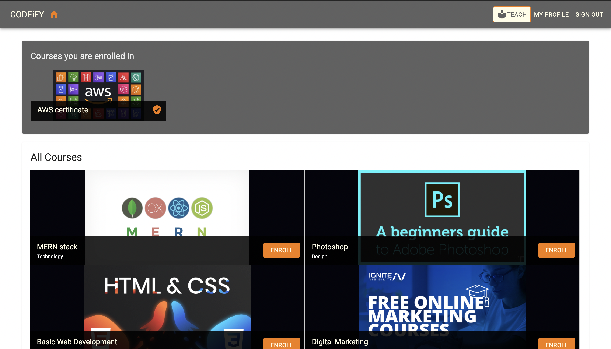
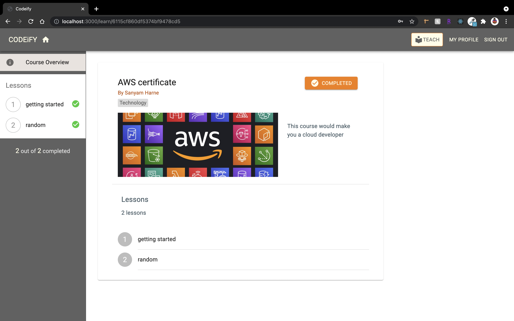
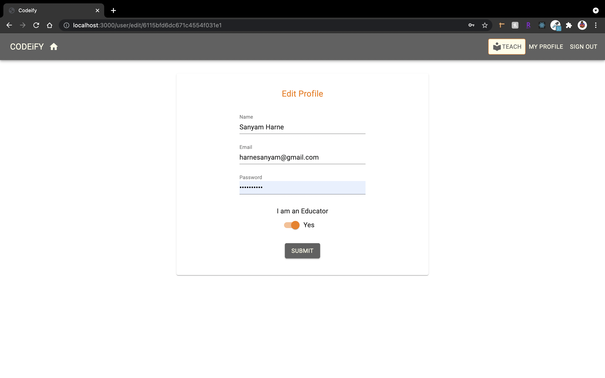
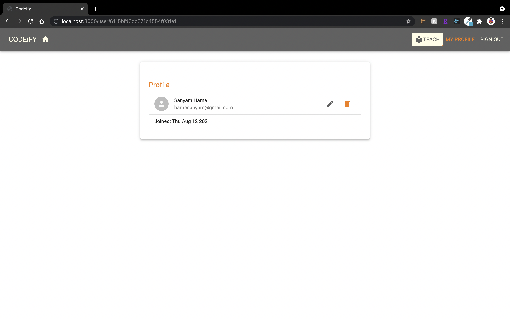
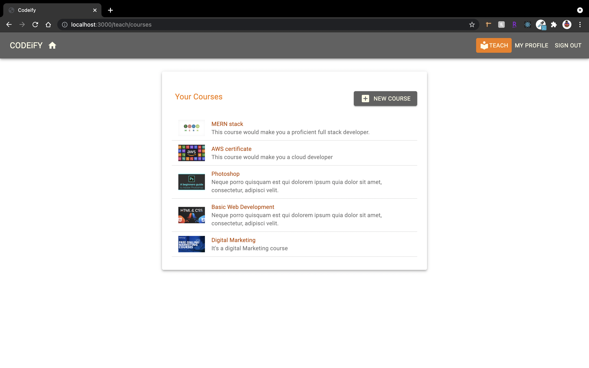

# Team Code Of Duty: Making a Edu Learn Platform using MERN Stack

## Application details - 
We are building a cutting-edge website with an incredible assortment of courses so that you can learn coding,
anywhere, at any time.
The web app would allow you to purchase courses and also view all your purchased courses in a consolidated view.

Users:

Administrators:
       They can add new course, edit the course (change the price of the course offered, give discounts etc.)  and also remove it from the list of courses.

Customers:
     They can buy the course and learn by watching videos related to their course, also view their purchase history.

 

Elements:

Login and authentication:
Edit, Delete and Add course.
Payment Validation
Other features: Redirecting to YouTube videos from the course links. View all the courses from the purchase history.
 

## Technology stack:

    ReactJS
    Express
    Redux
    HTML, CSS, JS
    Database – (Mongo DB)

## Setting up the development environtment - (Contribution by Amirthavarshini Sockalingam Bama) 
Source code editor - Visual studio code.
Installations - 
Installing nvm package manager to manage the versions. 
After installing that, we would be installing all the dev dependency modules. 
@babel/core
babel-loader for transpiling JavaScript files with Webpack
@babel/preset-env and @babel/preset-react to provide support for React, and the latest JavaScript feature

webpack.
webpack-cli to run Webpack commands.
webpack-node-externals to ignore external Node.js
module files when bundling in Webpack.
webpack-dev-middleware to serve the files emitted from
Webpack over a connected server during the development of the code.
webpack-hot-middleware to add hot module reloading into an existing server by connecting a browser client to a Webpack server and receiving updates as code changes during development.
nodemon to watch server-side changes during development,
so the server can be reloaded to put changes into effect.
react-hot-loader for faster development on the client
side. Every time a file changes in the React frontend, react-
hot-loader enables the browser app to update without re-
bundling the whole frontend code.
@hot-loader/react-dom to enable hot-reloading support
for React hooks. It essentially replaces the react-dom
package of the same version, but with additional patches to support hot reloading.

Now the basic set up would be over, now later to this we will be configuring babel, webpack and nodemon.
Next step would be client side and server side configuration.
To create frontend views with React - template.js is a root file we creating for front-end. 

Enable express in server.js file. 

Connect the mangodb to server. 

After all this set-up try running the application, it would show hello world in the local host. 

Note : For this application you need node version greater than or equal to 13. 

## Backend Components:(Contribution by Yash Manish Kothari)

Used Node, Express and MongoDB to form the complete backend which will be a standalone server-side application that can handle all of our HTTP requests.

## Authentication and User Model(Contribution by Yash Manish Kothari):
We have used the JWT mechanism to implement our authentication features. The schema for the user model will support the following attributes atleast:
* Name (String): Required field to store the user's name.
* Email (String): Required unique field to store the user's email and identify each account (only one account allowed per unique email).
* Password (String): A required field for authentication. The database will store the encrypted password and not the actual string for security purposes.
* Created (Date): Automatically generated timestamp when a new user account is created.
* Updated (Date): Automatically generated timestamp when existing user details are updated.

## Handling http requests(Contribution by Yash Manish Kothari):
To handle HTTP requests and serve responses properly, we will use the following modules to configure Express:
* body-parser: Request body-parsing middleware to handle the complexities of parsing streamable request objects so that we can simplify browser-server communication by exchanging JSON in the request body.
* cookie-parser: Cookie parsing middleware to parse and set cookies in request objects.
* compression: Compression middleware that will attempt to compress response bodies for all requests that traverse through the middleware.
* helmet: Collection of middleware functions to help secure Express apps by
setting various HTTP headers.
* cors: Middleware to enable cross-origin resource sharing (CORS).

 ## Publishing courses - (Contribution by Yash Manish Kothari) 
Only courses that have been published will be available for enrolment to other users on the site. After an instructor has built a course and added lessons to it, they can choose to publish it. All visitors will be able to see the published courses since they will be featured on the main page.
 * Publisbed button states:
   When an instructor logs in, the PUBLISH button appears in one of three states, depending on whether the course may be published or not, and if it has previously been published.
 * Confirm to publish 
  When the instructor clicks the PUBLISH button, a dialog box appears, alerting them of the actions' implications and offering them the choice to PUBLISH or CANCEL the action.

## API creations - (Contribution by Amirthavarshini Sockalingam Bama) 

Updating the user with an educator role: 
Users who sign up to the pplication will have the choice to become an educator on the platform by selecting this option in the EditProfile form component. 
In order to become an educator in the application, a signed-in user will need to update their profile. They will see a toggle in the EditProfile view, which will either activate or deactivate the educator feature. To implement this, first, we will update the EditProfile component in order to add a Material-
UI Switch component in FormControlLabel. 

## Adding courses   - (Contribution by Amirthavarshini Sockalingam Bama) 
 - defining a course model 
 -create course API :
     A user who is signed in—and who is also an educator—will be able to create new courses.
- Fetching the create API in the view.

## Updating courses with lessons  - (Contribution by Amirthavarshini Sockalingam Bama) 
 - Each course will contain a list of lessons that make up the course content and what the students need to cover when they enroll.

## Adding a lesson API  - (Contribution by Amirthavarshini Sockalingam Bama) 
 Educators on the application will be able to add new lessons to the courses that they are still building and have not yet published.
- Adding a lesson API:
   New lesson component. 
    -In each course, while it is still unpublished, the instructor will be able to add a lesson by filling out a form. In order to implement this form view to add new lessons, we will create a React component called NewLesson, which will be added to the Course component. 
  
## Displaying lessons  - (Contribution by Amirthavarshini Sockalingam Bama) 
The lessons for a specific course will be rendered in a list—along with a tally of the total number of lessons. To render this list of lessons, we will update the Course component to iterate over the array of lessons with a map function, and each lesson will be displayed in a Material-UI ListItem component.

## Deleting courses   - (Contribution by Amirthavarshini Sockalingam Bama) 
 In the application, instructors will be able to permanently delete courses if the course has not been published already. In order to allow an instructor to delete a course, first, we will define a backend API for course deletion from the database, and then implement a React component that makes use of this API when the user interacts with the frontend to perform this deletion.
 - DELETE route takes the course ID as a URL parameter and checks if the current user is signed in and authorized to perform this delete, before proceeding to the remove controller method
 
  
 ## Listing published courses - (Contribution by Amirthavarshini Sockalingam Bama) 
 All visitors to the application will be able to access the published courses. In order to present these published courses, we will add the feature to retrieve all the published courses from the database, and display the courses in a list on the home page. 
  - published courses API
  In order to retrieve the list of published courses from the database, we will implement an API in the backend, by first declaring the route that will take a GET request at '/api/courses/published.

## Adding Working React FrontEnd - (Contribution by Sanyam Harne) :
The CODEiFY application basic frontend was finished by adding a functioning React frontend, which included frontend routing and rudimentary server-side rendering of React views.
* We started off by updating the development flow so that it included client-side code bundling for the React views. We updated the configuration for Webpack and Babel to compile the React code and discussed how to load the configured Webpack middleware from the Express app to initiate server-side and client-side code compilation from one place during development.
* Added the relevant React dependencies, along with React Router for frontend routing and Material-UI, to use their existing components in the skeleton app's user interface.
* Implemented the top-level root React components and integrated React Router, which allowed us to add client-side routes for navigation.
* Using these routes, we loaded the custom React components that we developed using Material-UI components to make up the skeleton application's user interface.
* To make the React views dynamic and interactive with data fetched from the backend, we used the Fetch API to connect to the backend user APIs. Then, we incorporated authentication and authorization on the frontend views.
* Modified the server code so that we could implement basic server-side rendering, which allows us to load the frontend routes directly in the browser with server-side rendered markup after the server recognizes that the incoming request is actually for a React route.

## Delete course component - (Contribution by Sanyam Harne) 
 When a course teacher is logged in and visiting an unpublished course, they will see a delete option on the Course page. This option will be implemented in a separate React component named DeleteCourse, which will be added to the Course component. The DeleteCourse component is basically a button, which, when clicked, opens a Dialog component asking the user to confirm the delete action
 

## Enrolling on Courses - (Contribution by Sanyam Harne) 
 Visitors to the app will be able to sign up for an account and then enroll in any of the available courses. Enrolling in a course gives them access to lesson information and allows them to work their way through the lessons in order to complete the course.To store enrollment details in the database, we'll first build an Enrollment model. Then, when end users interact with the Enroll component that will be added to the frontend, we will add the backend API to make new enrollments.
 *  Defined an enrollment model 
 In order to record the details of each enrollment in the application, an Enrollment schema and model must be defined. It will contain fields for storing the course reference as well as the user who is enrolling as a student. It will also save an array matching to the lessons in the linked course, which will keep track of the student's progress through each lesson.
 * Created enrollment api 
  We will generate a new enrolment and save it in the backend when a user chooses to enroll in a course. To implement this functionality, we must first build a create enrollment API on the server by creating a route at 'api/enrollment/new/:courseId' that takes a POST request.
  The findEnrollment controller method will query the database's Enrollments collection to see if an enrollment with the provided course ID and user ID already exists.
* Read enrollment api 
 The backend API which will return the enrollment details from the database will be defined as a GET route that accepts the request
at '/api/enrollment/:enrollmentId'.

* Screen Shots below : 

